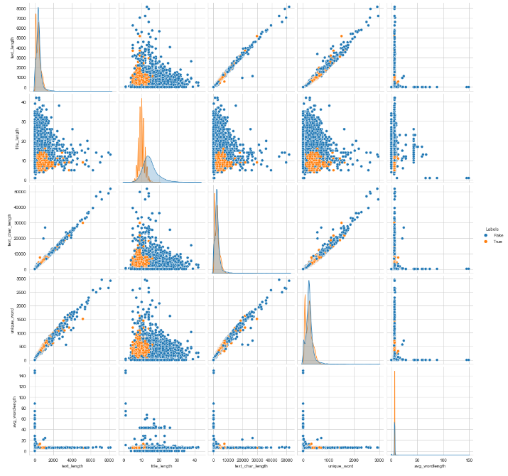
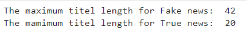
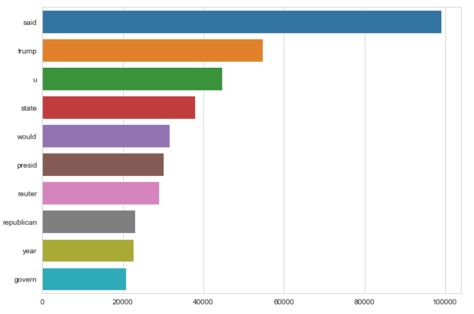
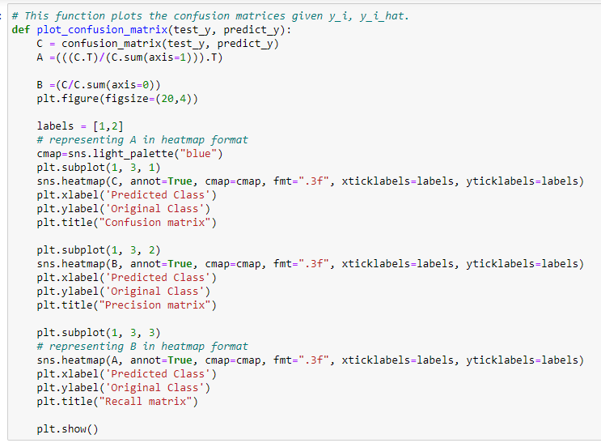

# Content

### Phase 1: Literature Survey and Data Sources**

-   Abstract

-   Business problem

-   Dataset

-   Key metric (KPI) to optimize

-   Real world challenges and constraints

-   Model production and re-train

-   How are similar problems solved in literature?

-   References

**Phase 2: EDA and Feature Extraction**

-   EDA

-   Feature Extraction

-   Base model train

-   Dimensionality Reduction

**Phase 3:** **Modeling and Error Analysis**

-   Modeling

-   Error Analysis

-   Different Model building and Hyper Parameter tuning

-   Error Analysis of Final model

**Phase 4: Advanced Modeling and Feature Engineering**

-   ML Pipeline

-   Interpretable of lime

**Phase 5 & Phase 6: Deployment and Productionization & Project Report**

-   FAST API

-   End Goal

-   API building

-   User Interface

-   Deployment

# Project: Predict the Fake News

**Phase 1: Literature Survey and Data Sources:**

**Abstract:**

The Internet is among the most important inventions of our time, and it
is used by a large number of people. People use the internet for a
variety of purposes. There are different social media platforms that are
accessible to these users. Any user can make a post or spread the news
through these online platforms. The spreading of accidental or malicious
misinformation on social media, specifically in critical situations,
such as real-world emergencies, can have negative consequences for
society. Due to the exponential growth of information online, it is
becoming impossible to decipher the true from the false. Thus, this
leads to the problem of fake news.

Recently, fake news has gained a lot of attention around the world.
There are a variety of effects, including political, economic,
organizational, and even personal ones. It is impossible for a human
being to detect all of these fake news stories. There is a need for
machine learning classifiers that can detect these fake news
automatically. This systematic literature review describes the use of
machine learning classifiers to detect fake news.

**1. Business problem**

**1.1 Introduction:**

Fake news is the deliberate spread of misinformation using traditional
news media or using social media. Media bias differs from fake news
because the underlying facts are true but may be presented selectively
or misleadingly to encourage the reader to think a particular way. Fake
news is low-quality news, having the wrong information. The wrong
information is put intentionally, with aim of spreading. Propagandists
usually manipulate the news for conveying the political influence or
message.

In our daily lives, we use Artificial Intelligence (AI) for many things,
like Netflix movie recommendations, social media advertisements,
personal assistants, and insurance rate predictions. Applying machine
learning for decision making makes human life easy. Fake news detection
is a subtask of text classification and is often defined as the task of
classifying news as real or fake. In this problem machine making
decision between news is fake or real.

In this project, we teach our machine how to read and understand the
differences between real news and the fake news using concepts like
Natural Language Processing (NLP), TF-IDF (text representation model)
,Bag of words, Machine Learning and prediction classifiers like the
Naïve Bayes Classifier ,Logistic regression classifier etc. which will
predict the truthfulness or fakeness of an article.

**1.2 Real--world Impact:**

Disinformation (fake news) is a major problem that affects modern
populations, especially in an era when information can be spread from
one corner of the world to another in just one click.

There has been a global impact of fake news in recent years. Fake news
is often spread through the use of fake news websites, which, in order
to gain credibility, specialize in creating attention-grabbing news,
which often impersonate well-known news sources. Jestin Coler, who said
he does it for \"fun\", has indicated that he earned US\$10,000 per
month from advertising on his fake news websites. Social media and
online outlets suffer far more from fake news than traditional print and
television outlets. After a survey was conducted, it was found that 58%
of people had less trust in social media news stories as opposed to 24%
of people in mainstream media after learning about fake news.

Several factors have been implicated in the spread of fake news, such as
political polarization, post-truth politics, motivated reasoning,
confirmation bias, and social media algorithms. Fake news can reduce the
impact of real news by competing with it. This the reason why we are
solving this problem.

**1.2 Challenges:**

The main challenge in this problem is the understanding differentiate
between fake news and bias news. Media bias is when journalists, news
producers, and news outlets show bias in the selection of events and
stories as well as the ways they are reported.

Another challenge is to collect data and identifying it as fake or real.
To label a news fake or true we have to go through all of its facts and
mark them manually which takes lots of time.

**2. Dataset**

**2.1 Source of the dataset**

Obtaining a real world dataset to train a model is very difficult
because obtaining a data which is labeled a time consuming task. We can
manually generate the dataset by collecting news and verifying its fake
or not.

For this project we are going through the dataset which one is provided
by applied Ai roots. The dataset consists of news title, content,
subject, date and label of the corresponding date. We have to predict
whether the news is fake or not based on given features.

Link for dataset:

<https://www.kaggle.com/datasets/akshayaki/fakenews> (This dataset
contains almost 45k rows)

**2.2 Tools:**

In this project we are going to use pandas as our primary tool to
preprocess our data (Pandas is a Python library used for working with
data sets. It has functions for analyzing, cleaning, exploring, and
manipulating data.). apart from that we will use numpy , matplotlib ,
nlp and sklearn.

**2.3 Dataset properties and challenges:**

In our dataset lots of rows contend YouTube, twitter and other social
media link .handling this kind of rows is the main challenge in data
preprocessing.

**2.4 Requirement Analysis:**

1.  **Functional Requirements**

-   Purpose: To predict the Fake News. The system tells whether
    there is a News Fake or not.

-   Inputs: User will provide News Title and News Description as
    an input.

-   Output: The system predicts where the news is fake or real.

-   Usability: It provides ease of use. System is very
    user-friendly. It is less complicated to work

2.  **Hardware Requirements**

-   Computer system

-   8,16 GB Ram

-   Intel i3 and above processor

-   Server Overhead

-   Port 8000

-   Internet connectivity

3.  **Software Requirements**

-   Notepad++ or any Code Editor

-   Anacoda Navigator , Jupyter Notebook

-   MS-Excel

-   Python 3

-   Python libraries like pandas, NumPy etc.

-   scikit-learn

-   Client environment may be Windows or Linux

-   Web Browser

**3. Key metric (KPI) to optimize**

In this project our end goal is to classify the news into two class fake
and true to achieve this goal we will create a model which will provide
minimum loss.

In order to propagate the loss, we must compare the model output with
the ground truth. For training and evaluating the model, I would like to
use the following metrics.

**3.1 Log-loss:**

Log loss is a loss metric that lies between \[0, ∞\]. A model with a
lower loss value is better than one with a higher loss value. As opposed
to other metrics, log loss deals with direct probability scores. In
spite of the difficulty of interpreting raw log-loss values, log-loss is
still a useful metric for comparing models. Logarithmic loss leads to
better probability estimation at the cost of accuracy.

Consider a set of n points, log loss for these data set can be defined
as:-

Here p(yi)= Probability that the class belongs to 1,

And yi=~ Actual class label,

N = total no of data points.

So, our task is to minimize the log loss.

**3.2 Confusion matric:**

Confusion matrices are used to summarize the performance of
classification algorithms. A confusion matrix shows the difference
between the actual and predicted values. It measures the performance of
our Machine Learning classification model and looks like a table-like
structure.

The higher TP and TN means our model is working well on data set.
Confusion matric gives information about errors made by the classifier
and the types of errors that are being made. It reflects how a
classification model is disorganized and confused while making
predictions. This feature assists in prevailing over the limitations of
deploying classification accuracy alone. The confusion matrix is hugely
suitable for calculating Recall, Precision, Specificity, Accuracy and
AUC-ROC Curve.

TP= the model has predicted yes, and the actual value was also true.

FP= the model has predicted Yes, but the actual value was No. It is also
called a Type-I error.

FN= the model has predicted no, but the actual value was Yes, it is also
called as Type-II error.

TN= Model has given prediction No, and the real or actual value was also
No.

-   Accuracy: It is one of the important parameters to determine the
    accuracy of the classification problems. It defines how often the
    model predicts the correct output. It can be calculated as the ratio
    of the number of correct predictions made by the classifier to all
    number of predictions made by the classifiers.

-   Precision: It can be defined as the number of correct outputs
    provided by the model or out of all positive classes that have
    predicted correctly by the model, how many of them were actually
    true.

-   Recall: It is defined as the out of total positive classes,
    how our model predicted correctly. The recall must be as high as
    possible.

**4. Real world challenges and constraints**

**4.1 Latency requirements:**

There is no need for real time output in microsecond. But the model
should be

Lite enough to generate the output within a few seconds or minutes

**4.2 Challenges:**

The main problem that occurs while training fake news classifiers is
that mostly the

Training data set in an imbalanced form. So we have to use different
technique like under sampling, over sampling to balance the dataset.

**4.3 Interpretability:**

The interpretability of algorithms could potentially improve user
attitudes toward them, according to numerous research studies. In order
to explain predictions of Natural Language Processing (NLP) models, four
interpretation methods were categorized: back-propagation based,
perturbation based, local approximation based, and decomposition based.
In back-propagation methods, gradients or variants of gradients for a
model prediction are computed based on the inputs. Model prediction can
be based on gradient values for each word in the input. As an
alternative, perturbation-based techniques can estimate word
contributions by occluding input information. Murdoch, Liu, and Yu
(2018) found that decomposition-based methods could simulate the data
flow process by calculating the additive contribution to final
predictions of each input word. Finally, local approximation-based
methods can be used to explain a complex model\'s predictions by
approximating its behavior around an input instance. A recent review of
interpretable fake news systems demonstrates the benefits of
interpretability in fake news detection, including allowing end-users to
identify model weaknesses so they can build trust in model predictions.

**5. Model production and re-train**

**5.1 Model production:-**

After training and testing the model out task is to deploy the model in
real-world. We can deploy our model in different way like by using
streamlit or creating API using flask or Django.

In our project we create an API using flask and we will deploy it any
cloud server like bluehost, AWS , AZUR etc. After that we can use the
trained model by integrating the API in website or mobile application.

**5.2 Model monitoring:-**

Model performance monitoring is the process of tracking the performance
of your machine learning model based on live data in order to identify
potential issues that might impact the business. we need to monitor the
data or model is ingesting in the upstream pipeline because 'garbage in,
garbage out'. our model is sensitive to the input data it receives. If
there's a change in the statistical distribution of the trained data
from the data in production, model performance will decline
significantly. Another data quality issue to watch out for is data
drift. This simply means that there's a change in the statistical
properties of data. The most straightforward way to monitor ML model is
to constantly evaluate your performance on real-world data. You could
customize triggers to notify you when there are significant changes in
metrics such as accuracy, precision, or F1. If you find that there is a
significant decrease in these metrics, it may indicate that there is a
critical issue with your data or with your model. Or we can use
different type of tools like Neptune and Qualdo to monitor our model.

**5.3 Model re-train:-**

After monitoring and tracking your model performance, the next step in
model management is retraining your machine learning model. The
objective is to ensure that the quality of your model in production is
up to date. There are two type of retraining online and offline
retraining.

With offline learning, you are creating a new system from scratch with
updated data. The process is simple and straightforward, but the
business goals must drive your retraining strategy.

Online retraining also known as incremental learning. The system is
retrained incrementally by passing data instances sequentially. As data
arrives, your model is being retrained. It makes retraining easier and
does not assume how the data is distributed. Customer behavior is not
taken into account. There are some Sci-kit Learn algorithms that support
online learning. It is possible for these algorithms to learn
incrementally, without having to load all the instances at once. There
is a method called partial_fit API available for these estimators. The
retraining time is short and it\'s good for out-of-core learning.

**6. How are similar problems solved in literature?**

Many researchers have tried to solve this challenge in a number of ways
to find a method that works and produces results that are desirable.
Studies have examined features extraction and model construction from a
data mining perspective to detect fake news. In the early days of
artificial intelligence, researchers were interested in data mining and
natural language processing approaches, but researchers became
increasingly interested in neural network-based approaches as AI
research and development progressed. It was shown in a paper that a
model of recurrent neural networks could be used for stance detection of
fake news by capturing, scoring, integrating, and creating a model of
recurrent neural networks. The authors used a recurrent neural network
to obtain a temporal pattern of user interaction around a specific
article/text, so they could extract source characteristics from the user
behavior.

**7. References**

-   [**https://arxiv.org/ftp/arxiv/papers/2102/2102.04458.pdf#:\~:text=There%20is%20a%20need%20for%20a%20way%20to%20detect%20these,can%20automatically%20detect%20fake%20news.**](https://arxiv.org/ftp/arxiv/papers/2102/2102.04458.pdf#:~:text=There%20is%20a%20need%20for%20a%20way%20to%20detect%20these,can%20automatically%20detect%20fake%20news.)

-   [**https://towardsdatascience.com/fake-news-detection-with-machine-learning-using-python-3347d9899ad1**](https://towardsdatascience.com/fake-news-detection-with-machine-learning-using-python-3347d9899ad1)

-   [**https://data-flair.training/blogs/advanced-python-project-detecting-fake-news/**](https://data-flair.training/blogs/advanced-python-project-detecting-fake-news/)

-   [**https://medium.com/swlh/fake-news-detection-using-machine-learning-69ff9050351f**](https://medium.com/swlh/fake-news-detection-using-machine-learning-69ff9050351f)

-   [**https://www.researchgate.net/publication/353824797_Fake_News_Detection_and_Prediction_Using_Machine_Learning_Algorithms**](https://www.researchgate.net/publication/353824797_Fake_News_Detection_and_Prediction_Using_Machine_Learning_Algorithms)

-   [**https://www.analyticsvidhya.com/blog/2022/03/fake-news-classification-using-deep-learning/**](https://www.analyticsvidhya.com/blog/2022/03/fake-news-classification-using-deep-learning/)

-   [**https://towardsdatascience.com/the-fight-against-fake-news-with-deep-learning-6c41dd9eaae4**](https://towardsdatascience.com/the-fight-against-fake-news-with-deep-learning-6c41dd9eaae4)

-   [**https://www.sciencedirect.com/science/article/pii/S2405959521001375**](https://www.sciencedirect.com/science/article/pii/S2405959521001375)

**\
**

### Phase 2: EDA and Feature Extraction:

**EDA: -** Exploratory Data Analysis, or EDA, is an important step in
any Data Analysis or Data Science project. EDA is the process of
investigating the dataset to discover patterns, and anomalies
(outliers), and form hypotheses based on our understanding of the
dataset.

**Feature Extraction: -** Feature Extraction is transforming textual
data into numerical data. In Natural Language Processing, Feature
Extraction is a very trivial method to be followed to better understand
the context. After cleaning and normalizing textual data, we need to
transform it into their features for modeling, as the machine does not
compute textual data. So we go for numerical representation for
individual words as it's easy for the computer to process numbers**.**

<https://www.kaggle.com/datasets/akshayaki/fakenews>

First, have a look at the data sets.

We can see we have 5 columns title, text, subject, date, Labels.

Form our date first we check where there is any rows are there whose
text column contains only a space.

-   From the above image we can see there is 627 blank cells in text
    columns.

Now we will check the number of fake news and true news.

-   From above image we can say that our data set contains 23481 or 52%
    fake news and 21417 or 47% True news.

we check the data is balanced or not.

-   From the bar chart we can see that dataset have almost equal number
    of true and fake news.

After that we have seen the distribution of subject column

-   We can see our maximum data is come from "politics news" and "word
    news" And all the news from politicsNews and worldnews are have True
    class label and other news are Fake class label.

From the dataset we have extracted different type of features.

-   text_length= number of word containing in "text" column in a
    particular row.

-   title_length= number of word containing in "title" column in a
    particular row.

-   text_char_length= number of character present in "text" column.

-   unique_word= number of unique word present in "text" column.

-   avg_wordlength= number of character in a text / number of word in a
    text

-   unique_vs_words= unique_word in a text/ number of words in a text.

-   number_of_link= number of links contains in "text" column.

-   number_of_noun= number of noun present in "text" column.

-   number_of_verb= number of noun present in "text" column.

-   number_of_adj= number of adjective present in "text" column.

We plot correlation between this extracted features.

-   The box which have color in dark blue color is indicates that high
    positive correlation.

Now we plot pair plot.

We can properly see that the points are over lapping each other so it's
difficult for us to analysis the plot. So we will go for single variable
analysis.

1st we analyze the number of links contain in text column.

We can see almost 3500 fake news contains 1 link in text column where
only less than 500 true news contains 1 link.

So conclusion is fake news have more probability to containing a link.

Now we analyses the title length column and we can see the fake news
have large title length as compare to true news.

We alse try to see the percentile values of title lenth of true news.

Same way we try to show the percentile value of title length of fake
news .

We also try to plot the distribution of "unique_word" column.

Now we use word cloud to visualize which word is used in maximum time
for true news text

We can see the word said use in maximum time in true news. Same way we
try to visualize for fake news.

We can see trump word is used maximum time for fake news.

After that visualization we remove all the stop words, link and special
character from our text column and convert it into vector using
countvectorizer and try to train a base lavel model using naïve bise
algorithem .

-   We use above code to remove stopwords ,link ,speciel character and
    create two new column "clean_title" and "clean_text"

After creating "clean_title" and "clean_text" we found out there was 9
cells where "clean_title" is null so we replace the null with a blank
space.

We store the "clean_text" column into variable x and "Labels" column
into y label.

**Base Model train:**

Now we devide the data into four part X_train and y_train for training
the mode.

X_test and y_test for testing the mode.

**Countvectorizer=** CountVectorizer is a great tool provided by the
scikit-learn library in Python. It is used to transform a given text
into a vector on the basis of the frequency (count) of each word that
occurs in the entire text. This is helpful when we have multiple such
texts, and we wish to convert each word in each text into vectors (for
using in further text analysis).

Here I am using maximum feature 5000 and ngram upto 3.

After trainng this model we are tring to print accuracy and confusion
metrix.

We got almost 95% accuracy.

From our confusion metrix we can see we have a high True positive and
true nagative rate that means our model is not overfited.

**Dimensionality Reduction:-** In machine learning classification
problems, there are often too many factors on the basis of which the
final classification is done. These factors are basically variables
called features. The higher the number of features, the harder it gets
to visualize the training set and then work on it. Sometimes, most of
these features are correlated, and hence redundant. This is where
dimensionality reduction algorithms come into play. Dimensionality
reduction is the process of reducing the number of random variables
under consideration, by obtaining a set of principal variables. It can
be divided into feature selection and feature extraction.

Here we use T-SNE to reduce our dimantion into 2-D.

1^st^ we wen use the extracted features and reduce the feature into 2-D

2^nd^ we use text column and convert that column into countvectorizer
and reduce the dimention into 2-D

From the above plot we can see we can easily saparate classes from this
2-D plot.

**Phase 3:** **Modeling and Error Analysis:**

**Modeling: -** A machine learning model is defined as a mathematical
representation of the output of the training process. Machine learning
is the study of different algorithms that can improve automatically
through experience & old data and build the model. A machine learning
model is similar to computer software designed to recognize patterns or
behaviors based on previous experience or data. The learning algorithm
discovers patterns within the training data, and it outputs an ML model
which captures these patterns and makes predictions on new data.

**Error Analysis:-** Error analysis is the process to isolate, observe
and diagnose erroneous ML predictions thereby helping understand pockets
of high and low performance of the model. When it is said that "the
model accuracy is 90%" it might not be uniform across subgroups of data
and there might be some input conditions which the model fails more. So,
it is the next step from aggregate metrics to a more in-depth review of
model errors for improvement.

**Dataset link:-**

<https://drive.google.com/drive/folders/1iDWs_fsqFmuyifRHH8agxqEJ51ab4UCq?usp=sharing>

(the folder contains all the csv files which we used in this project)

Note:- In our project we try out to build model in two type of dataset
one is where the text and title columns contains stopwords and another
is where the text and title column doesn't contain any stopwords.

-   Stop words: - A stop word is a commonly used word (such as "the",
    "a", "an", "in") that a search engine has been programmed to ignore,
    both when indexing entries for searching and when retrieving them as
    the result of a search query.

Performance of the base model which contains Stopwords:

  ---------------------------------------------------------------------------------------------------------------------------------------------------------------------------------------------
  Train Accuracy                                                                                 Test Accuracy
  ---------------------------------------------------------------------------------------------- ----------------------------------------------------------------------------------------------
  
  

  ---------------------------------------------------------------------------------------------------------------------------------------------------------------------------------------------

Performance of the base model which doesn't contains Stopwords:

  -----------------------------------------------------------------------------------------------------------------------------------------------------------------------------------------------
  **Train Accuracy**                                                                              **Test Accuracy**
  ----------------------------------------------------------------------------------------------- -----------------------------------------------------------------------------------------------
    
                                   

  -----------------------------------------------------------------------------------------------------------------------------------------------------------------------------------------------

From the above table we can easely conclude that the model which have
stopwords performing litle bit better then the model which doesn't have
stopwords. So we will build our complex model on the dataset which havse
stopwords.

List of performance score of other algorithem which does not contains
stopwords.

  --------------------------------------------------------------------------------------------------------------
  K-nn           
  algorithem     
  -------------- -----------------------------------------------------------------------------------------------
  Naive Bayes    

  SGD Classifier 
  --------------------------------------------------------------------------------------------------------------

**Different Model building and Hyper Parameter tuning:-**

1.  1^st^ we are going to implement SGD clasifier and try to tune the
    hyper parameter.

SGD Clasifier:- SGD Classifier implements regularised linear models with
Stochastic Gradient Descent. Stochastic gradient descent considers only
1 random point while changing weights unlike gradient descent which
considers the whole training data. As such stochastic gradient descent
is much faster than gradient descent when dealing with large data sets.

-   From above image we can see that SGD classifier is working well when
    the alpha value is 1. Training log loss is 0.2689 and Test log loss
    is 0.2715.

-   From above confusion metrix we can see TP and TN is high that mean
    model is working good and not bias toward a single class.

-   We also show the precision matrix and recall matrix.

2.  We are going to implement Naive Bayes clasifier and try to tune the
    hyper parameter.

Naïve Bayes:- Naïve Bayes algorithm is a supervised learning algorithm,
which is based on Bayes theorem and used for solving classification
problems.

It is mainly used in text classification that includes a
high-dimensional training dataset.

Naïve Bayes Classifier is one of the simple and most effective
Classification algorithms which helps in building the fast machine
learning models that can make quick predictions.

-   From above image we can see that Naive Bayes classifier is working
    well when the alpha value is 1e-05. Training log loss is 0.1311 and
    Test log loss is 0.1358 which is quite better than SGT classifier.

-   From above confusion metrix we can see TP and TN is high that mean
    model is working good and not bias toward a single class.

3.  We are going to implement Random Forest clasifier and try to tune
    the hyper parameter.

Random Forest:- Random Forest is a classifier that contains a number of
decision trees on various subsets of the given dataset and takes the
average to improve the predictive accuracy of that dataset.

-   From above image we can see that Random Forest classifier is working
    well when the best estimator value is 1000. Training log loss is
    0.008 and Test log loss is 0.012 .

-   From above confusion metrix we can see TP and TN is high that mean
    model is working good and not bias toward a single class.

After applying SGD , Naïve Bayes , Random Forest algorithem we realise
that Random Forest works good for our dataset so we will train our final
model using random forest.

-   We trained our random forest model where n_estimetor= 500 and
    max_depth=50. Form above image we can see that train accuracy is 99%
    and test accuracy is 99%.

From the model we perdict y_test and create a dataset which contans
y_true and y_predict as column.

**Error Analysis of Final model :-** To analyze the error we create a
dataset where our predicted output is not equal to true output.

And Extracting following information.

You can see the error is very minimul.

Now we will plot a bar plot of "number_of_link" column.

-   From the above ptot you can see maximum error occur from the rows
    where "number_of_link" is 0.

And plot a Histogram from Title length column.

-   From the above plot we can conclude that maximum error occur from
    the News where "title_length" is almost 10.

**Phase 4: Advanced Modeling and Feature Engineering**

**ML pipeline:-** ML pipeline is a means of automating the machine
learning workflow by enabling data to be transformed and correlated into
a model that can then be analyzed to achieve outputs. This type of ML
pipeline makes the process of inputting data into the ML model fully
automated.

In this section we create a machine Learning pipeline for our model. We
are using random forest for our final model.

-   To create the pipline we use ColumnTransformer to transfer the
    extracted feature into minmax scale .

-   And we convert the text features into countvectorizer

-   And end of it apply random forest of max_depth=10, n_estimators=500.

Accuracy of our model.

After that we store our model into clasifier.pkl file.

We created another simple ML pipeline to Impliment Lime

-   Here we created a pipline wich will take news title and text as an
    input and convert the text data into count vectorizer and apply
    random forest on top of that.

Accuracy of our simple model.

Same way we save our model into "simple_classifier.pkl"

You can see there is no much difference between accurecys of Main model
and simple Model.

Lime model:- We create two vaiable text and title and store news text
and title into that and after that we apply lime to our data to explain
the prediction.

Periction by main model:-

**Interpretation by lime:-**

-   From the above chart you can see thereson behind why the prediction
    is true.

### Phase 5 & Phase 6: Deployment and Productionization & Project Report**

The final phase of this project.is Deployment, here we are deploying the
whole machine learning pipeline into a production system, into a
real-time scenario. In this final stage we need to deploy this machine
learning pipeline to put of research available to end users for use. The
model will be deployed in real world scenario where it takes continuous
raw input from real world and predict the output.

SGD, Random Forest, Naive Bayes were trained using the trained dataset,
it was found that , Random Forest gives the best performance.

**Fast API:-** FastAPI is a Web framework for developing RESTful APIs in
Python. FastAPI is based on Pydantic and type hints to validate,
serialize, and deserialize data, and automatically auto-generate OpenAPI
documents.

**End goal:-** Our end goal is for this phase is create a fast api app
where we will create a post method and which take text and title as
input and return the prediction.

Another side we create a html pages where user can interact and use the
app.

**API building:-**

Create project folder and inside the folder create graph folder store
clasifier.pkl and simple\_ clasifier.pkl into it.

Create 3 python file :- main.py , text_to_row.py, FakeNewsClass.py

**main.py**

This file contains all the routes.Here we open the pkl file and use the
file to predict.

Here we create two routes one is get route which redict intio index and
another is POST route /predict which is used to predict.

**text_to_row.py**

This file contains row_gen function which takes news title and text
argument and generate feature remove symbols links.concatinate title and
text and create a new column 'all_text' And return the list.

**FakeNewsClass.py**

**Run:-**

To run the api in our local mechine we go to terminal and run following
command.

uvicorn main:app --reload

The app will run 127.0.0.1:8000 port

To test the api we have to go following link.

[***http://127.0.0.1:8000/docs***](http://127.0.0.1:8000/docs)

To test the api we have to pass title and text as string.

***Output:-***

From the output we can see that ourt model is predicting the news as
True news with 79.35% probability.

**User Interface:-** To create user Interface here we use html, css and
javascript. Create a folder name uI. Inside the folder create following
files.

**Index.html**

**Analysis.html**

**Prediction.html**

To use the mechine learing model we have to past news title and text
inside following text box and click prediction button.

We can see our model is predicting the news is true with 79.35%
probability.

**Reason behind prediction.**

The page alse so reson using lime model output.

# Deployment:

**Deploying machine learning models using AWS:**

Deploying over the internet increases the accessibility of your
application. After deployment app can be accessed from mobile, computer
from anywhere in the world. We delploy our API model using AWS.

**Step1:**

1st create a aws account.

**Step2:**

Now create a EC2 instance and download private key.

**Step 3:**

Use public IPV4address to connect aws.

**Step 4:**

Install putty , puttygen and winscp software in your pc.

**Step 5:**

Use puttygen to convert .ppe key into .ppm

**Step 6:**

Use winscp to move the api files into aws.

Note:- you have to login using ip addres user name and ppm key.

Step 7:

Use putty to access termilan of aws where we have to install
requierments.txt and run the app.

**Output:-**

We can see our api is rung on Public IPv4 DNS

